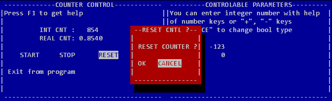
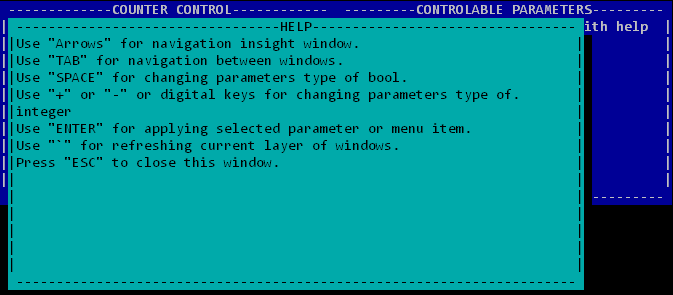

# tui
Simple library for creating old-school text user interface for interaction via uart or telnet (VT100 standard mostly).

# Features
- as simple as can be;
- no dependencies;
- object-oriented approach;
- no OS needed.

# Some Screens

# Build and Run
I use Eclipse + minGW and C++11. So if you have eclipse, import this project, build and run.
Example build for Windows, that don't support ANSI escape sequences, so use ANSICON (https://github.com/adoxa/ansicon) or ConEmu (https://conemu.github.io/)
